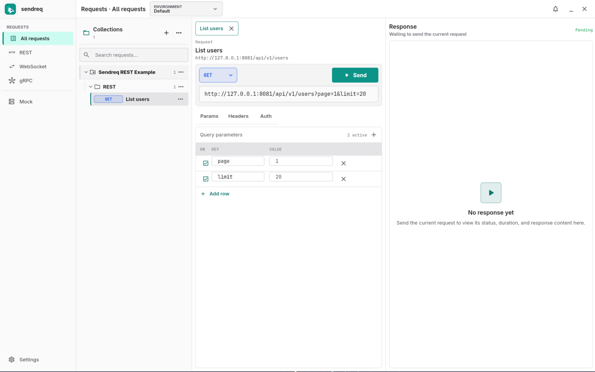

# sendreq

sendreq 是面向开发与测试人员的本地优先桌面 API 工具。产品只保留 Requests、Mock、Settings 三个入口：Requests 负责 REST、WebSocket 和 gRPC 的配置、执行与结果检查；Mock 只负责本地 HTTP 模拟；Settings 只负责外观、语言和字体偏好。

> sendreq is a local-first desktop API tool with three focused workspaces: Requests, HTTP Mock, and Settings.



## 核心工作流

- 在 Requests 中使用 Collection、Folder 和 Request 组织接口资产。
- 在当前 Request 中编辑、发送并检查 HTTP 当前响应。
- 在当前 Request 中运行 WebSocket 与 gRPC 长连接，并查看有界收发时间线。
- 在 Request 顶栏切换 Environment；选择立即影响下一次调用，不需要保存。
- 只有编辑 Environment 变量、Secret、Auth 或结构时才需要局部 Apply/Discard。
- 从当前 HTTP 响应的已脱敏快照创建独立、可持久化的本地 HTTP Mock Server。
- 关闭 Request 或应用后释放 HTTP 当前结果与长连接时间线，不持久化通用执行记录。

## 协议支持

### HTTP / REST

支持 GET、POST、PUT、PATCH、DELETE，以及 Params、Headers、Auth、JSON、XML、URL 编码表单和 multipart。发送前解析环境变量与认证；响应进入界面前完成脱敏。

### WebSocket

支持 `ws://` / `wss://`、Headers、子协议、Text、JSON、XML、Binary、MessagePack 和 Protobuf。连接使用启动时冻结的 Environment/Auth 快照；配置变化后显式重连。

### gRPC

支持本地 `.proto`、descriptor set 和 server reflection，覆盖 unary、client streaming、server streaming、bidirectional streaming 四种 RPC 形态。

- 新建 gRPC Request 默认 `No auth`。
- 按需启用 Bearer、Basic 或 API Key，不强制内部微服务使用鉴权。
- Message、Metadata、Auth、Proto 各司其职，不显示 HTTP Params。
- 请求 Preview、出站消息和入站消息统一为两空格格式化、可折叠、可复制的 JSON。
- 运行中的调用冻结 endpoint、TLS、Environment、Auth、metadata、deadline 和 method；配置变化后显式 Restart。

## 持久化边界

持久化 Collection、Environment、偏好、HTTP Mock Server 和需要后续处理的安全通知。HTTP 响应、WebSocket 时间线和 gRPC 时间线只属于当前 Request 的内存状态。旧版本留下的非当前资产记录不会主动擦除，但应用不再读取、展示或派生。

## 内置示例

**Sendreq REST Example** 是唯一可加载示例集合，只包含一个 REST `GET` Request。首次启动保持空白工作区，不自动写入示例数据；WebSocket、gRPC 与 Protobuf 测试资源不会随示例或安装包分发。

## 本地开发

```bash
flutter pub get
flutter analyze
flutter test
flutter build linux
```

桌面运行：`flutter run -d windows`、`flutter run -d macos` 或 `flutter run -d linux`。

## 发布

推送与 `pubspec.yaml` 版本一致的 `vX.Y.Z` 标签会启动 Windows、macOS 和 Linux 构建、测试与打包流程。正式版本提供平台安装包及 SHA-256 校验文件。
